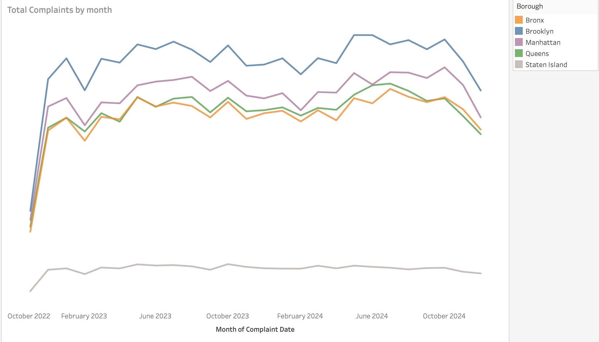

# nypd-complaints-analysis
**Uncovering NYC's crime patterns: A data analysis project using BigQuery and Tableau to visualize temporal and geographic trends in NYPD complaint data**.

This project analyzes three years of NYPD complaint data to uncover patterns in when, where, and how incidents are reported across New York City. It combines large-scale SQL processing in BigQuery with an interactive Tableau dashboard designed to support operational insight and public-facing storytelling.
As someone transitioning into data analytics from a social science background, I approached this project with two goals:

1. Demonstrate strong analytical and technical capability using real, messy, multi-gigabyte data.

2. Apply a human-centered lens to understand how reporting behaviours, demographics, and neighbourhood context influence complaint patterns.

The result is a dashboard that highlights borough-level trends, reporting delays, demographic disparities, and offense types in a format that is accessible to both technical users and non-technical audiences.

To build a performant dashboard suitable for Tableau Public, and due to Tableau Public's size limitations, the dashboard uses summary tables generated in BiqQuery. The full processing of the raw 3GB dataset - including cleaning, partitioning, clustering, feature engineering, and aggregate - is fully documented in the SQL scripts in this repository. 

This repository contains:

- Full SQL scripts for data ingestion, cleaning, enrichment, and aggregation

- Summary tables used for the interactive Tableau dashboard

- Screenshots and documentation of the final analytical insights

- A complete analytics case study demonstrating mid-level analytical capabilities

**Project Motivation** 

Complaints to police departments do not only reflect criminal incidents — they also reveal patterns in community behaviour, access to reporting, response expectations, and social conditions. An inital exploratory visualisation (illustrated below) on the daily complaint trends showed sharp fluctuations in crime reporting, suggesting that:  

- certain days or hours may experience more crime

- boroughs may differ significantly in complaint volume

- reporting delays may vary by offense

- demographic profiles may correlate with reporting behavior

This raised a core analytical question:

**What underlying patterns drive complaint behaviour across NYC, and how can these patterns inform public safety decision-making?**

The above question prompted further inquiries into police complaints in NYC including; 
- How do complaint volumes change overtime?
- Why are certain days or hours more active?
- Are some offences consistently reported late?
- What demographics are most represented among victims?
- Are specific boroughs driving the trend?
- Where should resource allocation be prioritised? 

This project address these questions through a structured, multi-layed analysis.

## 🛠 Tech Stack

| Component | Technology |
|:---|:---|
| Data Warehouse | Google BigQuery | 
| Data Cleaning & Feature Engineering | SQL (BigQuery Standard SQL) |
| Dashboard | Tableau Public |
| Version Control | Git + GitHub |
| Cloud Storage | Google Cloud Storage |

**1. Data Pipeline & Processing (BigQuery)**
**- Data ingestion**

Raw CSV (≈3GB) stored in Google Cloud Storage and loaded into BigQuery. The dataset contained mixed formats, missing timestamps, inconsistent text fields, and coded values

**- Data cleaning + standardization**

. Converted date/time fields into unified timestamps
. Trimmed and normalized text fields
. Standardized victim/suspect demographic values
. Reconstructed geography columns
. Derived key date/time features:

    complaint_year
    complaint_month
    complaint_dayofweek
    complaint_hour
    is_weekend
    offense_severity

 **Feature engineering**
To prepare the dataset for reliable analysis and visualisation, several feature-engineering steps were performed in Bigquery. These steps ensure consistent categorisation across millions of records, reduce noise in the raw data, and enable clearer insights for downstream Tableau dashboards. These include: 

. Reporting lag calculation
. Offense severity classification
. Borough-level aggregation
. High-frequency and low-frequency offense segmentation
. Victim age-group normalisation

**Reporting lag cleaning(fixing negative values)**
The raw timestamps often produce negative reporting lags due to:

. Partial or incorrect timestamps

. Administrative updates logged before incident timestamps

.  Data entry delays

Two cleaning rules were applied:

1. If reported_ts < complaint_from_ts, the record was discarded or labeled as "Unknown"

2. Median reporting lag was recalculated per offense category and borough

This produced clean, interpretable metrics for the Reporting Lag Quadrant Plot.

**High-Frequency and Low-Frequency Offense Segmentation**

To better understand offense patterns across New York City, the dataset was segmented into high-frequency and low-frequency offense categories. This step was essential given the wide range of offense descriptions with highly uneven distribution.

**Why segmentation was necessary**

NYPD complaint data contains dozens of offense categories. Without segmentation:

- Key trends become hidden in noise
- Rare categories distort bar charts
- Visualisations become overcrowded
- Insights shift toward outliers instead of dominant patterns

Segmentation ensures the analysis **prioritises crime types with greatest operational impact**.

**How segmentation was performed**

For each offense (offense description):

- Complaint totals were calculated
- A percentile distribution was computed
- The 75th percentile threshold classified offenses into:
. High-frequency
. Low-frequency

This statistical approach avoids arbitrary filters and highlights operationally meaningful categories.

**How segmentation powered the “Top Offenses” visualisation**

The “Top Offenses” bar chart intentionally displays only high-frequency offenses.
This ensures the visualisation focuses on categories that:

- Drive police workload
- Consistently appear across boroughs
- Demonstrate actionable patterns
- Inform resource allocation

Rare offenses remain available in the dataset but are excluded from main visuals to maintain clarity and analytical relevance.

**Victim Age Group Normalisation**

The raw vic_age_group field contained a mixture of:

Exact ages (e.g., “18”, “25”, “47”)

Ranges (e.g., “25-44”, “18-24”)

Free text (e.g., “UNDER 18”, “65+”)

To create a single interpretable variable, the field was cleaned and recoded into standardised age buckets:
<18  
18–24  
25–44  
45–64  
65+  
Unknown

This allowed the Victim profile chart to correctly stack and compare demographic patterns across boroughs, turning a noisy column into a usable analytical dimension.

**Summary tables creation**

The summary table was used for Tableau Public due to size limits

. Daily complaint trends
. Top offenses (recent 24 months)
. Hourly/offense heatmap matrix
. Reporting lag statistics (borough + offense)
. Victim demographic profiles

All summary tables are stored in data/summary_tables/

**2. Interactive Tableau Dashboard**
 Live dashboard: [https://public.tableau.com/app/profile/presca.evans/viz/NYPDComplaintsdata2/Dashboard22]

The dashboard features:

**a. Daily Complaint Trend**
- Continuous line chart showing long-term complaints

**b. Top Offences Bar Chart**
- Focuses on high-volume crime categories
- Helps prioritise policing and resource allocation

**c. Hourly-Day Heatmap**
- Reveals "crime activity hotspots" by time of day
- Useful for shift planning and operational readiness

Darker colours indicate peak complaint activity

**d. Reporting Lag Plot**
This analytical visualisation shows:
- Fast vs. slow reporting
- High vs. low complaints volume
- Borough-offence pairings
Colour-coded quandrants reveal operational risk zones. 

**e. Victim Demographic Profile**
- Age group distribution
- Gender distribution
- Helps identify vulnerable population

**3. Key Insights From the Analysis**

**.Clear weekend and evening surges** were visible across all boroughs, suggesting that community activity patterns — rather than isolated events — strongly influence when complaints are filed.

**.Assault, harassment, and grand larceny** consistently make up the highest share of reported offenses, pointing to recurring interpersonal and property-related concerns within NYC neighborhoods.

**.Reporting delays vary by borough**, with some areas showing slower reporting times around higher-severity offenses. This may reflect differences in access, community-police relationships, or logistical barriers to reporting.

**.Adults between 25–64 represent the majority of victims**, with men appearing more frequently in the dataset. This reinforces known demographic exposure patterns but also highlights who is most affected in daily urban environments.

**.Brooklyn recorded the highest volume of complaints between 2022 and 2024**, closely followed by Manhattan. The distribution mirrors both population density and patterns of public mobility across boroughs.

**.Complaint volume and reporting speed differ substantially by offense type** Certain crimes tend to be reported immediately, while others have longer lags — offering opportunities to better understand barriers to timely reporting.

**Temporal rhythms are strong predictors of complaint activity** Distinct patterns emerge by hour, day of the week, and season, demonstrating how community routines shape reporting behaviour.

These insights would help:

- Police departments schedule resources

- Community programs target interventions

- Policymakers understand reporting barriers

**4. Future Enhancements**

As I continue strengthening my data analytics skills, there are several improvements I plan to explore in future iterations of this project:

**.Expand the analysis with a borough map:**
Add a clean geospatial component that shows complaint density and severity patterns across NYC, enabling easier place-based storytelling.

**.Integrate neighbourhood-level social indicators:**
Combine complaint trends with contextual factors such as population density, age distribution, median income, or housing statistics to bring a more human-centered, social-science perspective to the findings.

**.Deepen temporal analysis:**
Explore weekday vs. weekend patterns, seasonal trends, and month-to-month changes to understand how community rhythms influence reported incidents.

**.Enhance victim demographics profiles:**
Add clearer categories for victim race, gender, and age to show disparities or protections needs across communities.

**.Improve data refresh process:**
Move from manual table creation to semi-automated BigQuery SQL scripts, so the summary tables used in Tableau update more efficiently over time.

**.Develop borough-level narratives:**
Use insights from the dashboard to craft short, data-informed case studies on how crime patterns differ by borough—leveraging my background in social sciences.

**.Explore predictive indicators (lightweight):**
Experiment with simple trend projections for future complaint volumes (e.g., using rolling averages), without requiring advanced machine-learning models.
