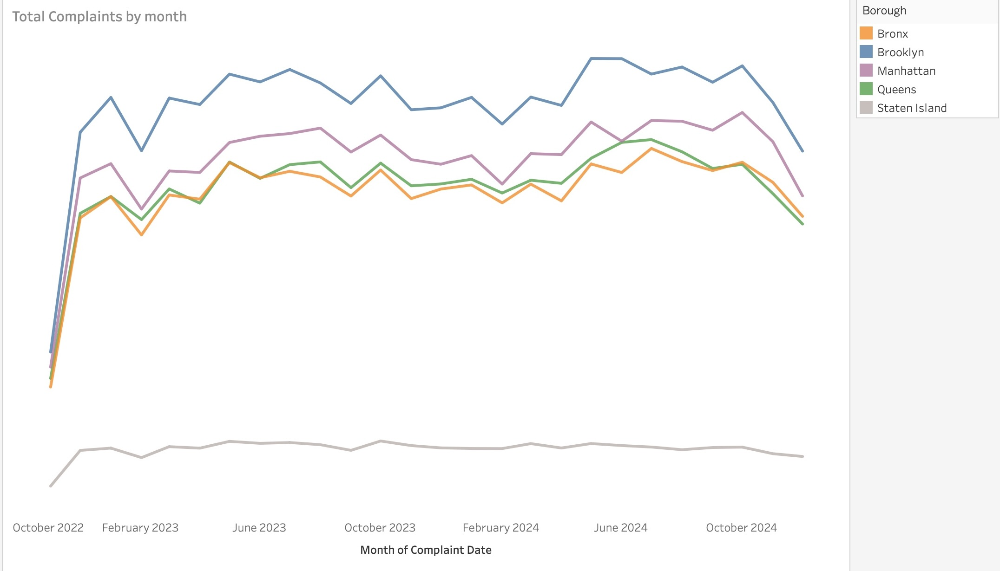
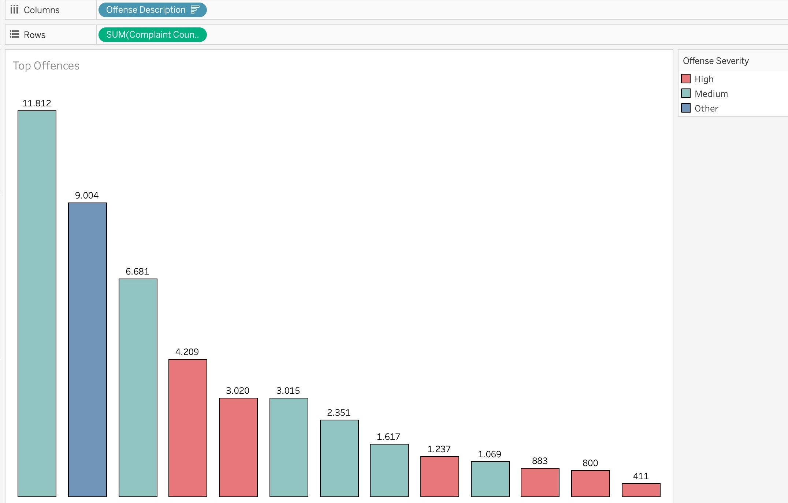
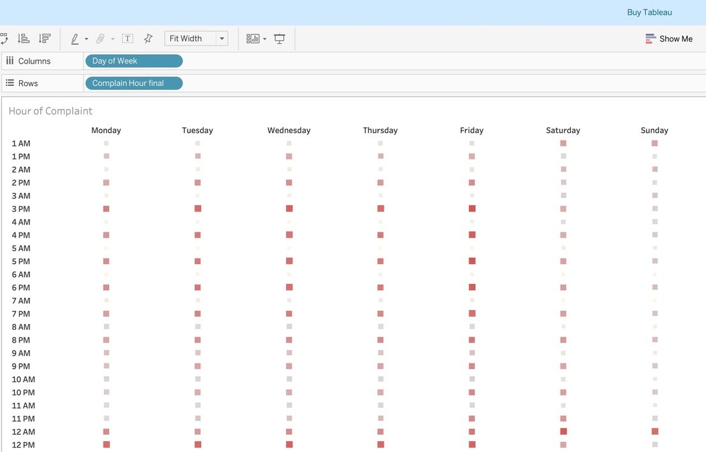
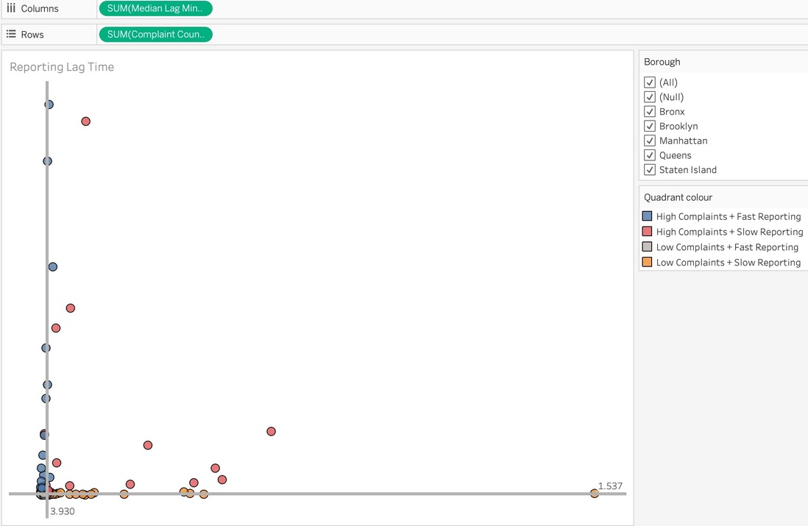
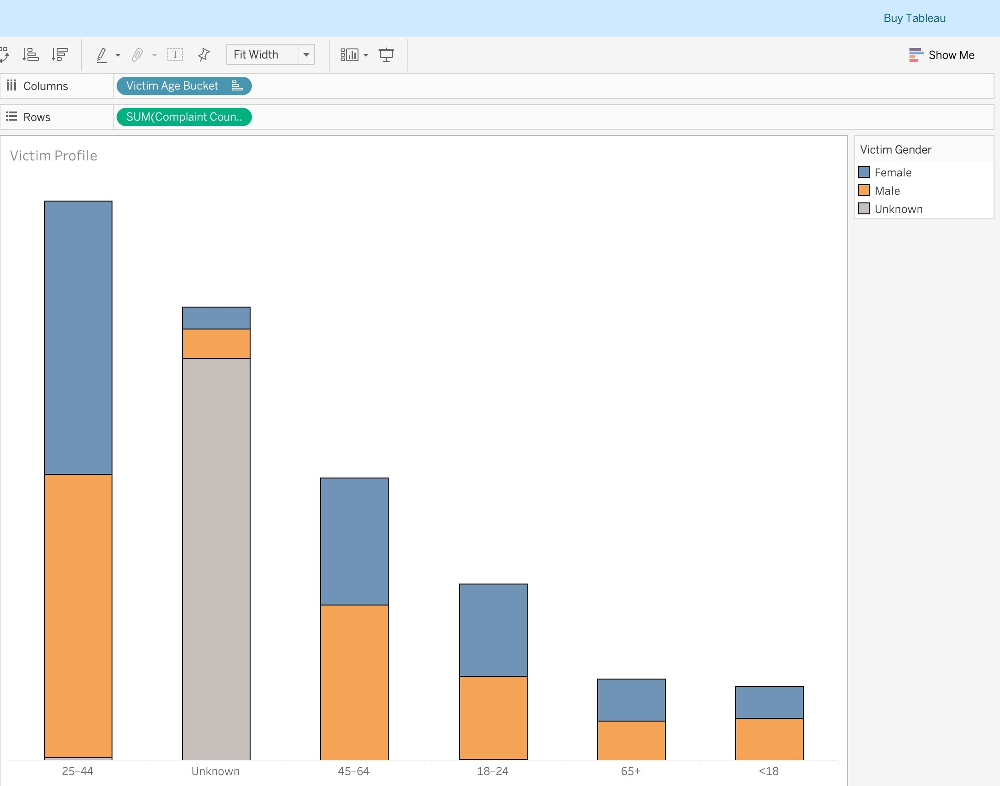

# NYC Complaint Reporting Visibility Pack
A **Reporting BA-style** visibility pack using **public NYC complaint data** to surface **demand patterns**, **workload drivers**, and **reporting-timeliness signals** that support operational planning and prevention discussions.

---

## 👩🏽‍💻 Author
**Presca Wanki** — **Service Performance & Insights Analyst (Reporting BA-style)**  
Focus: KPI definition, reporting requirements, data validation, and decision-ready insight for operational planning.

---

## ✅ At a glance
- **Primary decisions**
  - When do complaint volumes peak for shift and resource planning?
  - Which offence categories drive the largest share of workload?
  - Where do reporting-timeliness patterns suggest visibility gaps worth further review?
- **Primary users**
  - Public safety performance / insights teams
  - Borough-level operations and resource planning teams
  - Community safety stakeholders seeking high-level visibility
- **Tooling:** **BigQuery (SQL)** → **Tableau** → **GitHub documentation**
- **Deliverables:** Reporting requirements, KPI glossary, validation rules, dashboard views, decision-ready insights, and planning-oriented actions

**📊 Tableau Public dashboard:**  
[NYC Complaints Dashboard](https://public.tableau.com/app/profile/presca.evans/viz/NYPDComplaintsdata2/Dashboard22)

> **Data note:** Uses publicly available NYC complaint data. Outputs are presented at an aggregated level for analysis and planning.

---

## 🧩 What this project demonstrates
- **Reporting requirements definition** using user stories and acceptance criteria
- **KPI design and business rules** including reporting-timeliness logic
- **Data-quality governance** through timestamp standardisation, category normalisation, and invalid-value handling
- **Decision-oriented dashboarding** focused on action, not just charts
- **Interpretation discipline** through clear caveats on reporting bias and non-causality

---

## 🔎 Project overview
Complaint data provides a practical view of **reported service demand** and how it varies across time and geography. However, raw records often include inconsistent timestamps, missing fields, and large volumes that require transformation before they can support operational decisions.

This reporting pack is designed to answer five core questions:

1. **How do complaint volumes change over time and by borough?**
2. **Which offence categories drive the largest share of reported workload?**
3. **When do repeatable peaks occur that matter for planning?**
4. **Where do reporting-timeliness patterns vary by borough or offence category?**
5. **What high-level reported exposure patterns appear in available profile fields, with appropriate caveats?**

Rather than treating complaint records as direct evidence of total prevalence, this project treats them as a **reported-demand and visibility dataset** that can support planning discussions when interpreted carefully.

> **Ethics and scope note:** This is **not** a predictive policing tool and does **not** claim causality. Complaint data is shaped by **reporting behaviour, access, trust, and timing**. This pack is designed for **visibility, reporting, and planning** — not enforcement targeting.

---

## 👥 Primary users

This reporting pack is designed for stakeholders who need a structured view of **reported complaint demand**, **timeliness**, and **workload concentration**.

### Public safety performance / insights teams
- Monitor complaint trends over time
- Identify repeatable workload patterns
- Support consistent reporting and planning discussions

### Borough-level operations and resource planning teams
- Review peak demand windows for staffing and shift planning
- Track high-volume offence categories as workload drivers
- Use timeliness patterns as an input for further operational review

### Community safety stakeholders
- Understand high-level reported incident patterns
- Support prevention and outreach discussions using aggregated views
- Interpret findings with clear reporting-bias caveats

> **Out of scope:** This project is not designed for predictive policing, enforcement targeting, or causal claims about crime occurrence.

---

## 📌 Decisions this pack supports
- Aligning staffing and operational attention to **repeatable peak windows**
- Prioritising review of **high-volume offence categories**
- Flagging borough/offence combinations with **unusual reporting-timeliness patterns**
- Strengthening reporting consistency and metric transparency
- Supporting high-level prevention discussions using aggregated, caveated insights

---

## 🧱 Delivery approach (Requirements → KPI rules → validated model → dashboard)

This project follows a **reporting delivery pattern**:

1. Define decision needs  
2. Define KPI rules and reporting logic  
3. Validate completeness, missingness, and exclusions  
4. Publish dashboard views that support action

---

## 1) Reporting requirements (user stories + acceptance criteria)

### User story 1 — Trend visibility (demand over time)
**As a public safety performance lead,** I need complaint volume trends by borough over time so I can identify sustained increases, seasonality, and planning signals.

**Acceptance criteria**
- Trend view supports borough filtering or comparison
- Time grain is clearly labelled (for example, daily or monthly)
- Records with invalid or missing dates are excluded from time-series KPIs and handled transparently



---

### User story 2 — Workload drivers (top offences)
**As an operations planner,** I need to identify the highest-volume offence categories so I can prioritise workload drivers for planning and prevention discussions.

**Acceptance criteria**
- Offence labels are standardised and normalised
- Top offences update with borough and time filters where available
- Dashboard clarifies this is **volume-based**, not severity-based, unless a severity rule is explicitly defined



---

### User story 3 — Peak windows (hour × day rhythms)
**As a shift scheduler,** I need an hour-by-day view of complaint volumes so I can align staffing to repeatable peak windows.

**Acceptance criteria**
- Heatmap uses derived hour and day-of-week fields from standardised timestamps
- Weekend and weekday patterns are visible and comparable
- Filters apply consistently to the heatmap and related views



---

### User story 4 — Reporting timeliness
**As a community safety or performance lead,** I need reporting-timeliness insights so I can identify where delayed reporting patterns may warrant deeper review.

**Acceptance criteria**
- Reporting timeliness is defined as **Report Date − Occurrence Date (days)**
- Negative or invalid lags are treated as data errors, excluded, and documented
- Timeliness is viewable by borough and offence category where available
- Dashboard includes a caveat that timeliness is an **indicator**, not proof of cause



---

### User story 5 — Reported exposure profile (high-level)
**As a prevention or outreach stakeholder,** I need a high-level view of available reported exposure patterns to support discussion of prevention focus areas, with clear caveats.

**Acceptance criteria**
- Profile fields are presented as grouped categories where appropriate
- Unknown or missing values remain visible
- Dashboard includes a reporting-bias caveat: data reflects **reported incidents**, not total prevalence



---

### User story 6 — Data trust (transparency)
**As a reporting BA,** I need clear data-quality rules so stakeholders understand what is included, excluded, and standardised before relying on the metrics.

**Acceptance criteria**
- Timestamp parsing and standardisation rules are documented
- Invalid or negative reporting-timeliness values are documented
- Summary outputs reconcile to dashboard totals for the same filter set
- “Unknown” categories remain visible for transparency

---

## 2) KPI glossary (definitions & business rules)

| KPI / concept | Definition | Unit | Rules / caveats |
|---|---|---:|---|
| Total complaints | Count of complaint records | Count | Reflects reported incidents in the dataset, not per-capita prevalence |
| Complaints by borough | Complaint count grouped by borough | Count | Borough labels standardised where needed |
| Top offences | Highest-volume offence categories | Count | Offence labels normalised |
| Peak window | Highest-volume periods by hour/day | Time band | Derived from standardised timestamps |
| Reporting timeliness (days) | Report Date − Occurrence Date | Days | Negative or invalid values excluded as data errors |
| Delayed reporting (optional) | Timeliness above a defined threshold (e.g. 7+ days) | % / Count | Threshold must be stated if used |
| Profile category | Grouped demographic/profile field | Category | Unknown or missing values retained and visible |

---

## Limitations & assumptions
- Complaint data reflects **reported incidents only** and is influenced by reporting behaviour, access, trust, and timing.
- Volume patterns should not be interpreted as total prevalence or direct enforcement need.
- Reporting timeliness is a **visibility indicator**, not evidence of cause.
- Profile fields may be incomplete and should be interpreted only at a **high, descriptive level**.
- Findings are intended for **planning, reporting, and visibility**, not predictive or causal use.

---

## 3) Data validation & quality handling (trust in the numbers)

### Principles
- Standardise timestamps to protect trend accuracy
- Keep missingness visible
- Remove invalid timeliness values to protect KPI integrity
- Use summary outputs to keep Tableau performant

### Handling approach

| Risk area | Handling approach |
|---|---|
| Inconsistent timestamps | Standardised parsing and formatting before deriving hour/day fields |
| Text/category inconsistencies | Normalised key labels such as offence categories and boroughs |
| Negative/invalid reporting timeliness | Excluded and documented as data errors |
| Missing profile fields | Retained as Unknown/Null where relevant |
| Dashboard performance limits | Aggregated summary outputs used for visuals |

### Validation checks
- KPI totals reconcile between summary outputs and dashboard views for the same filters
- Reporting-timeliness values are non-negative after cleaning
- Hour/day fields are derived only from valid timestamps
- Unknown profile categories remain visible and are not silently dropped

---

## 4) Build & implementation (BigQuery → Tableau)

### Tech stack

| Component | Tool |
|---|---|
| Cloud data warehouse | Google BigQuery (SQL) |
| Visualisation / BI | Tableau Public |
| Version control | GitHub |
| Documentation | README.md |

### Implementation summary
1. Load raw complaint data into **BigQuery**
2. Clean and standardise timestamps and key categorical fields
3. Derive reporting features such as hour/day, offence groupings, reporting timeliness, and grouped profile fields
4. Generate summary outputs for Tableau performance

### SQL scripts (in order)
- `SQL Scripts/01_cleaning.sql`
- `SQL Scripts/02_summary_daily.sql`
- `SQL Scripts/03_summary_offences.sql`
- `SQL Scripts/04_summary_heatmap.sql`
- `SQL Scripts/05_reporting_time_lag.sql`
- `SQL Scripts/06_victim_profile_high.sql`

---

## 🌍 Key visuals (what to look for)

### 1) Trend line
**Look for:** sustained changes, borough differences, and possible seasonality signals  


---

### 2) Top offences
**Look for:** the offence categories driving the largest share of reported workload  


---

### 3) Complaint heatmap
**Look for:** repeatable peak windows by hour and day  


---

### 4) Reporting timeliness
**Look for:** variation in time-to-report patterns across boroughs or offence categories  


---

### 5) Reported exposure profile
**Look for:** high-level reported profile patterns, interpreted cautiously and descriptively  


---

## 📌 Key insights (decision-ready)
- **Complaints show repeatable rhythms** that can inform staffing and planning decisions.
- **Workload concentrates in a limited set of offence categories**, supporting prioritisation of the largest reported drivers.
- **Reporting timeliness varies by borough and offence category**, suggesting areas where visibility or access issues may warrant deeper review.
- **High-level profile views can support prevention discussions**, but only with clear acknowledgement of reporting bias and incomplete coverage.

---

## ✅ Recommended actions (planning-oriented)

| Theme | Action | Expected benefit | Success measure |
|---|---|---|---|
| Shift planning | Align staffing attention to repeatable hour/day demand patterns | Better preparedness during predictable surges | Peak-period demand coverage improves |
| Workload focus | Prioritise review of highest-volume offence categories | Focus effort on largest reported drivers | Consistent monitoring of top categories |
| Timeliness review | Review borough/offence areas with elevated reporting timeliness | Better understanding of visibility frictions | Timeliness distribution becomes more stable over time |
| Reporting governance | Maintain KPI glossary and validation rules | More consistent interpretation and trusted reporting | Fewer metric disputes; stable reporting cadence |

---

## 🚀 Future enhancements
- Add precinct-level geospatial views where appropriate and ethically justified
- Integrate contextual datasets with clear ethical framing
- Add seasonality modelling for planning support
- Create borough-specific mini packs for follow-up review
- Automate refresh of BigQuery summary outputs for lower-maintenance reporting

---

## 📁 Repository structure

```text
nypd-complaints-analysis/
├── README.md
├── LICENSE
├── Data/
│   ├── reporting_time_lag.csv
│   ├── summary_daily.csv
│   ├── summary_heatmap.csv
│   ├── summary_offences.csv
│   └── summary_victim_profile_high.csv
├── Images/
│   ├── Complaint_heatmap.jpeg
│   ├── Line_chart.jpeg
│   ├── Reporting_time.jpeg
│   ├── Top_Offences.jpeg
│   └── Victim_profile.jpeg
└── SQL Scripts/
    ├── 01_cleaning.sql
    ├── 02_summary_daily.sql
    ├── 03_summary_offences.sql
    ├── 04_summary_heatmap.sql
    ├── 05_reporting_time_lag.sql
    └── 06_victim_profile_high.sql